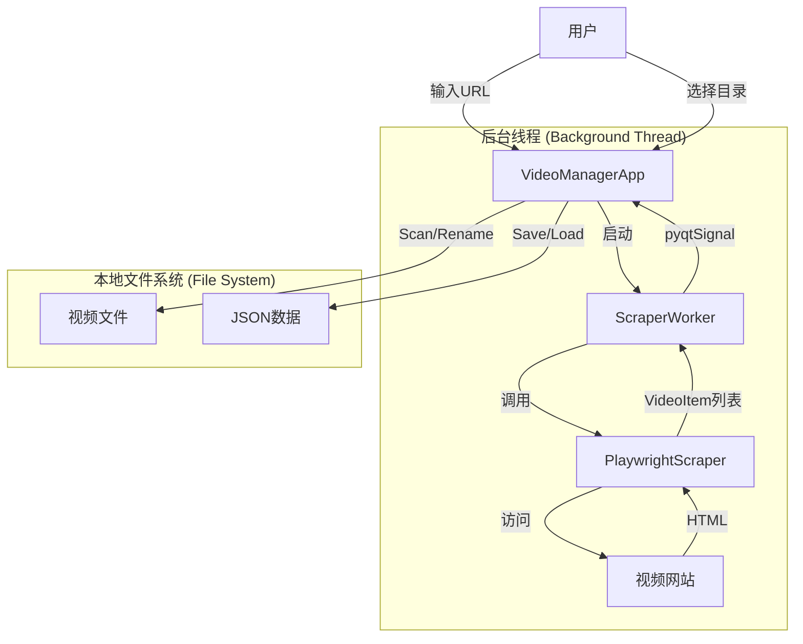

这是一个为您整理的**软件详细设计文档 (Detailed Design Document)**。该文档基于我们之前的讨论、代码迭代以及修正后的逻辑编写，旨在为该项目提供一个清晰的架构视图和开发蓝图。

---

# 视频元数据抓取与本地整理工具 - 设计文档

**Video Metadata Scraper & Organizer (VMSO)**

**版本**: 1.0
**日期**: 2026-01-25
**技术栈**: Python 3.x, PyQt5, Playwright

---

## 1. 项目概述 (Overview)

### 1.1 背景

用户经常从视频网站（如 Bilibili）下载系列教程或合集视频。下载后的本地文件往往命名混乱（缺失标题、只有编号，或只有标题无编号），导致难以管理和观看。

### 1.2 目标

开发一个 GUI 桌面应用程序，能够：

1. **抓取**：从网页 URL 提取结构化的视频元数据（标题、时长、层级）。
2. **关联**：将在线元数据与本地杂乱的视频文件进行智能匹配。
3. **整理**：提供可视化预览，并一键将本地文件重命名为标准格式（`序号 - 标题.后缀`）。

---

## 2. 需求分析 (Requirements)

### 2.1 功能需求

1. **数据采集 (Web Scraping)**
* 支持动态渲染的网页抓取（基于 Playwright）。
* 兼容多种列表模式：
* **多P模式 (Multi-P)**：一个系列包含多个分集。
* **单P模式 (Single-P)**：单个视频组成的扁平列表（如个人空间视频列表）。

* 提取字段：视频标题、时长。

2. **数据持久化**
* 支持将抓取到的结构化列表保存为 JSON 文件。
* 支持从 JSON 文件重新加载列表（无需重复抓取）。

3. **本地文件管理**
* 选择本地视频目录。
* 扫描指定后缀的视频文件 (`.mp4`, `.mkv`, `.avi` 等)。
* **核心功能**：刷新机制，确保每次匹配前重新读取磁盘文件列表。

4. **智能匹配 (Heuristic Matching)**
* 算法优先级：**数字索引匹配** (High Priority) > **文本相似度匹配** (Low Priority)。
* 可视化反馈：
* ✅ **匹配成功**：显示匹配到的本地文件名。
* ❌ **缺失**：网页有，本地无。
* ⚠️ **多余**：本地有，网页无。

5. **批量重命名**
* 清洗文件名（去除非法字符）。
* 统一格式化：`[001] - 标题.mp4`。
* 操作确认弹窗，防止误操作。

### 2.2 非功能需求

* **响应性**：抓取过程必须在后台线程运行，不能卡死 GUI。
* **稳定性**：处理网络超时、DOM 结构变更、文件被占用等异常。

---

## 3. 系统架构 (System Architecture)

系统采用经典的 **MVC (Model-View-Controller)** 变体模式，结合 **Worker Thread** 模式处理耗时任务。

### 3.1 模块划分

| 模块 | 类名 | 职责描述 |
| --- | --- | --- |
| **Model (数据层)** | `VideoItem` | 定义视频节点的树状数据结构，支持 JSON 序列化/反序列化。 |
| **Service (业务层)** | `PlaywrightScraper` | 独立的抓取逻辑封装。负责启动浏览器、解析 DOM、适配不同 HTML 结构。 |
| **Controller (控制层)** | `ScraperWorker` | 继承自 `QThread`。负责在后台线程调用 Service，通过 Signal 将数据回传给 UI。 |
| **View (视图层)** | `VideoManagerApp` | 主窗口。负责 UI 渲染、用户交互、文件扫描、匹配算法逻辑、重命名操作。 |

### 3.2 数据流图 (Data Flow)

---

## 4. 详细设计 (Detailed Design)

### 4.1 数据模型 (`VideoItem`)

设计为树状结构以支持“系列->分集”的层级。

* **属性**:
* `title`: 字符串，视频标题。
* `duration`: 字符串，时长。
* `is_group`: 布尔值，标识是否为系列头。
* `children`: List，子节点列表。
* `matched_file`: 字符串，匹配到的本地文件绝对路径（运行时动态属性）。
* `index`: 整数，全局排序序号（用于重命名）。

### 4.2 抓取服务 (`PlaywrightScraper`)

* **浏览器引擎**: Chromium (Headless)。
* **DOM 适配策略**:
* **Strategy A (Multi-P)**: 检测 `.multi-p` 元素。
* Group = Series Title
* Children = Page List Items

* **Strategy B (Single-P)**: 检测 `.single-p` 元素。
* Group = Video Title (Pseudo Group)
* Child = Video Title (Single Item)

* *目的*: 无论源网页结构如何，统一输出为“二级树状结构”，简化 UI 层的渲染逻辑。

### 4.3 智能匹配算法 (`match_files`)

这是系统的核心逻辑，用于将 `VideoItem` 与 `LocalFiles` 关联。

1. **预处理**: 调用 `scan_local_files()` 强制刷新内存中的文件列表。
2. **重置**: 清空所有 Item 的 `matched_file` 状态。
3. **遍历**: 对每个 `VideoItem` (Child node) 进行匹配：
* **Step 1: 索引匹配 (Index Matching)**
* 正则提取文件名开头的数字 `^(\d+)`。
* 若 `文件数字 == Item.index`，则 **直接锁定 (Lock)**。

* **Step 2: 模糊匹配 (Fuzzy Matching)**
* 仅当 Step 1 未命中时执行。
* 计算 `Item.title` 与 `filename` 的 Levenshtein 距离 (使用 `difflib`)。
* 取最高分文件。
* **阈值判定**: 仅当 Similarity Score > 0.4 时认定为匹配。

4. **UI 更新**: 渲染匹配结果（绿色/红色状态）。

### 4.4 线程安全与信号 (`ScraperWorker`)

* **问题**: `ScraperWorker` 无法直接操作 UI 控件。
* **解决**:
* Worker 定义 `finished_signal(list, str)`。
* UI 连接信号到 `on_scraping_finished` 槽函数。

* **关键修正**: 禁用/启用按钮时，**禁止**使用 `self.sender()`，因为 Lambda 表达式中的 `sender` 指向的是 Worker 线程对象而非按钮。必须显式引用 `self.btn_fetch`。

---

## 5. UI/UX 设计

### 5.1 界面布局

* **Top Area (Control)**: URL 输入框、抓取按钮、保存/加载 JSON 按钮。
* **Center Area (View)**: `QTreeWidget`。
* Col 0: 标题/结构 (树状展开)。
* Col 1: 时长。
* Col 2: 状态 (✅/❌)。
* Col 3: 匹配到的本地文件 (预览)。

* **Bottom Area (Action)**: 目录路径显示、选择目录按钮、匹配按钮、重命名按钮 (红色高亮)。

### 5.2 交互逻辑

* **抓取时**: 界面不冻结，按钮暂时禁用，状态栏显示“正在启动浏览器...”。
* **文件变更时**: 用户在操作系统中增删文件后，点击“智能匹配”按钮会自动触发目录重扫描，无需重启软件。
* **重命名**: 必须弹出 `QMessageBox` 列出前 5 个变更预览，用户确认后执行。

---

## 6. 异常处理策略

1. **Playwright 初始化失败**:
* 检测是否安装浏览器内核，若失败提示用户运行 `playwright install`。

2. **网络超时/元素未找到**:
* 设置 `timeout` 参数。
* 若未找到 `.video-pod__list`，捕获异常并通过 Signal 返回错误信息给 UI 弹窗。

3. **文件占用**:
* 重命名时若文件被播放器占用，`os.rename` 会抛出 `OSError`。
* 捕获该异常，统计失败数量，最终报告给用户。

